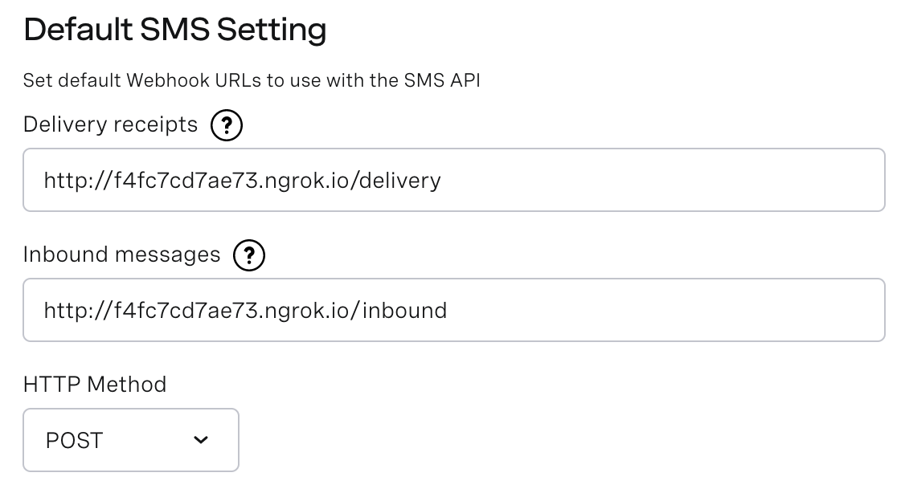
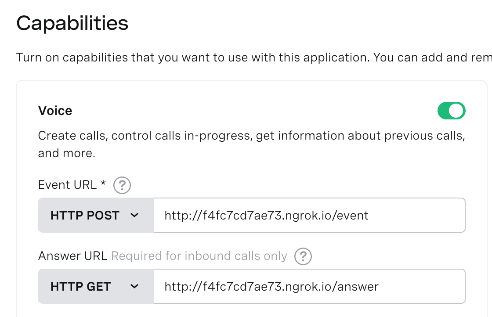

# nexmo-stock
Send a text message and receive a phone call with the latest stock information.

## Set up

Sign up to get an API key at [developer.nexmo.com](https://dashboard.nexmo.com/sign-up).

Create a [new application](https://developer.nexmo.com/application/overview#creating-applications).

Request an [Alpha Advantage free API key](https://www.alphavantage.co/support/#api-key).

Fill in the .env-example file with the API information above and rename to .env.

Start [ngrok](https://ngrok.com/) locally

    ngrok http 5000

Add event and answer URLs to your Vonage application.

Add the `/inbound` and `/delivery` urls to your account in the [Default SMS Setting](https://dashboard.nexmo.com/settings).

Add the `/answer` and `/event` urls to your application settings under voice capabilities.

Start the application

    export FLASK_APP=run.py
    export FLASK_ENV = development
    flask run

